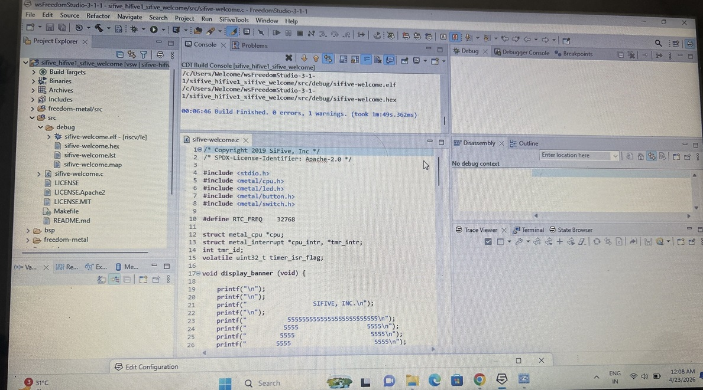
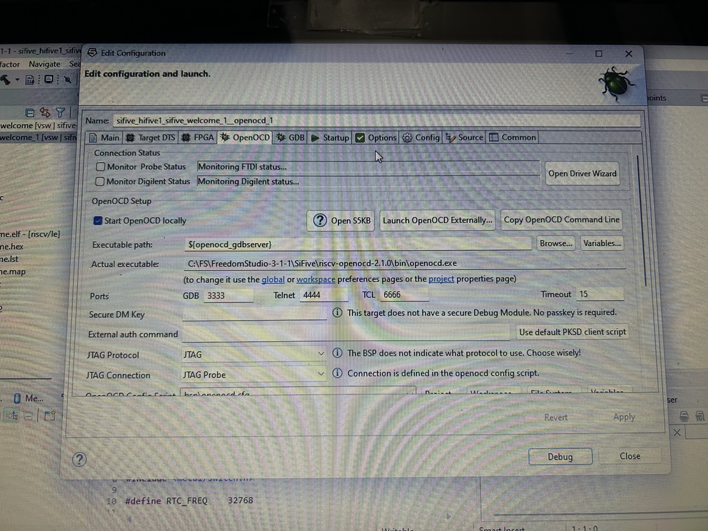
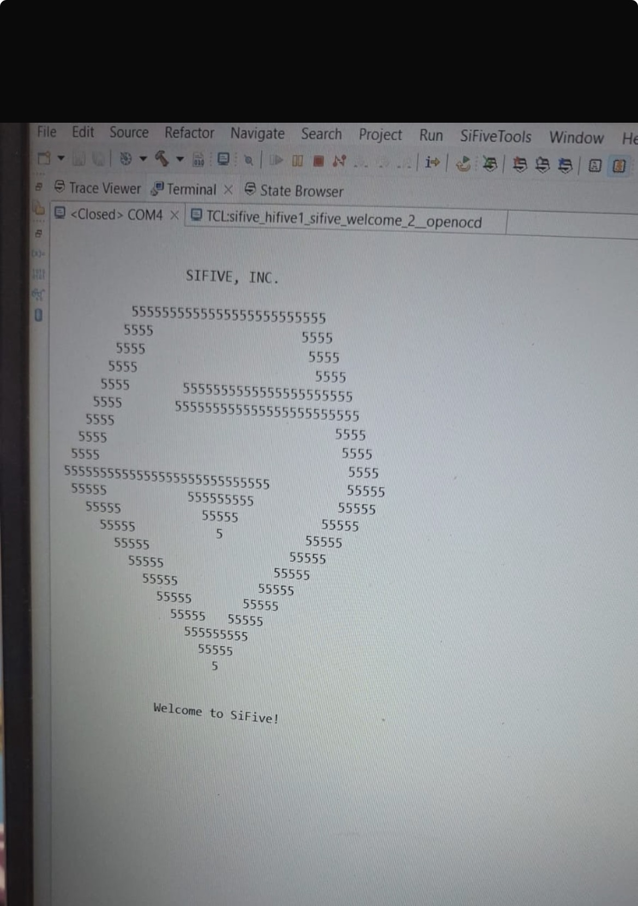
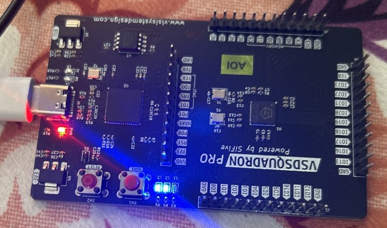

# Hardware-Setup-Validation-section
RISC-V Hardware Setup, Toolchain Installation and Board Validation using VSD Squadron PRO

## Overview
This repository documents the complete setup and validation of the VSDSquadron PRO RISC-V board.

---

## Contents
- [Installation Guide](installation_guide.md)
- [System Configuration](system_config.md)
- [Commands Used](commands_used.md)
- [Hardware Summary](hardware_summary.md)
- [Screenshots](screenshots/)

---

## Board Used
VSDSquadron PRO (SiFive based RISC-V board)

---

## Objective
- Install required tools
- Configure environment
- Run validation program
- Document full process

## Screenshots

### Driver Installation

### Setup Process

### Debug Session

### Output / Execution

### Hardware Setup

