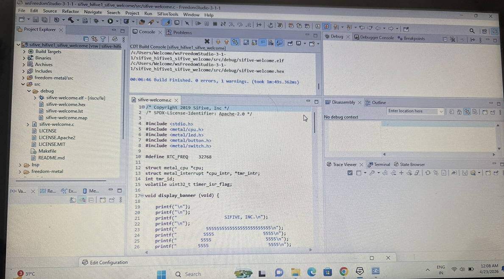
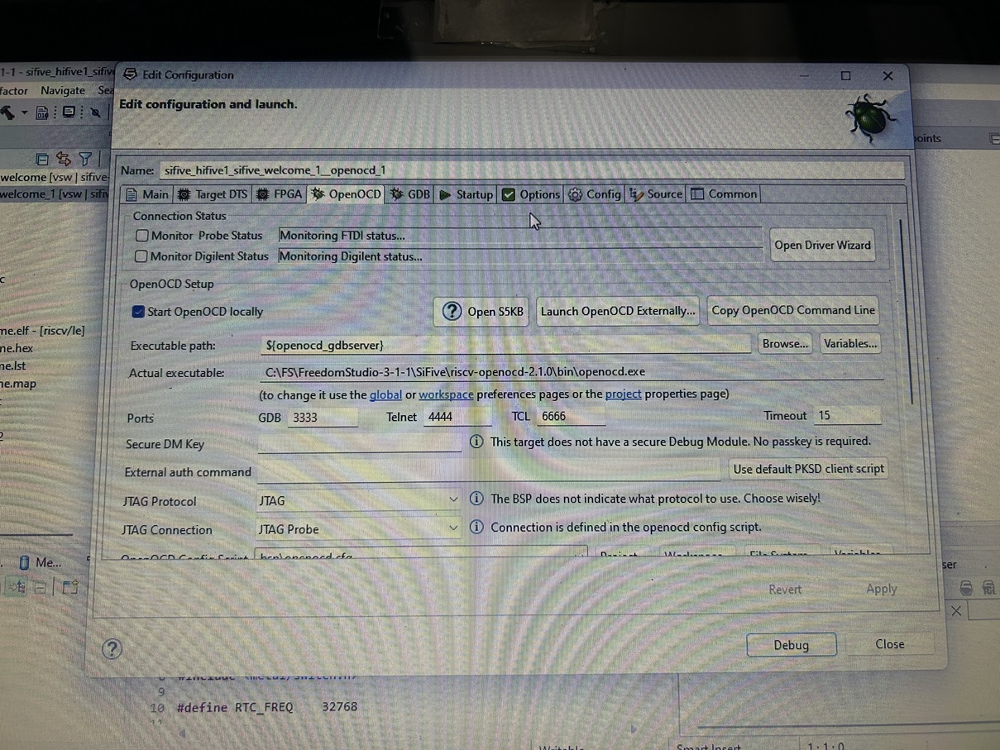
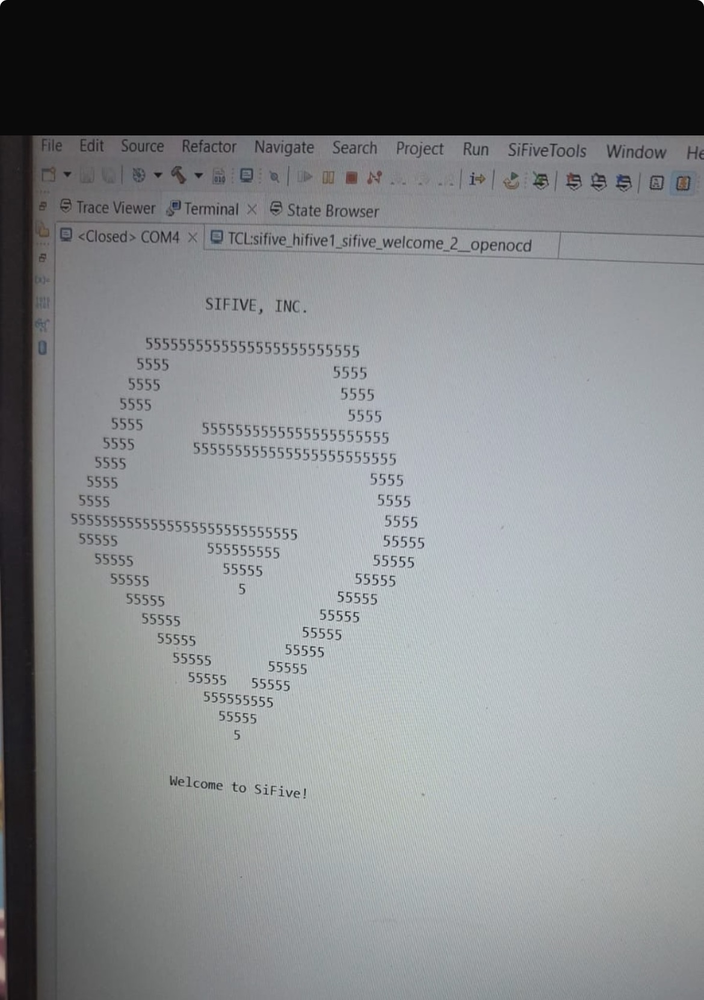
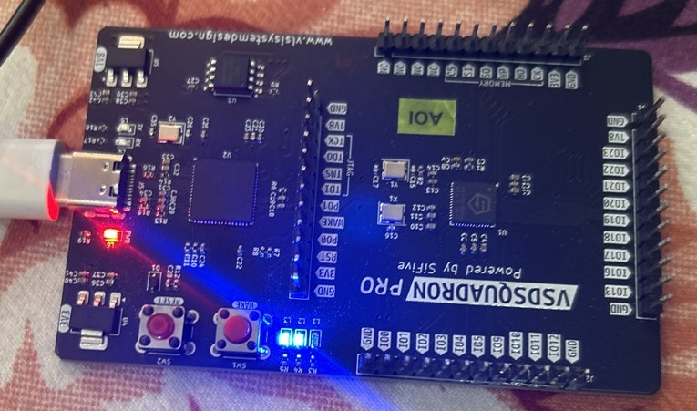
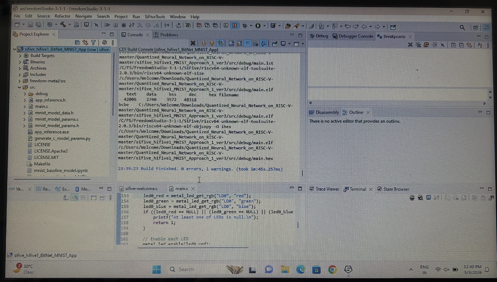
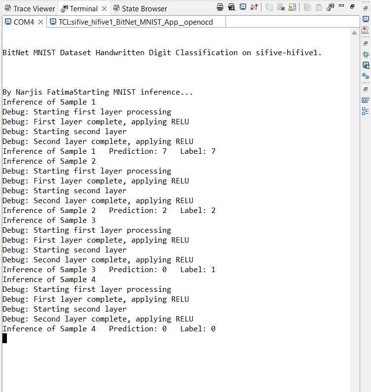
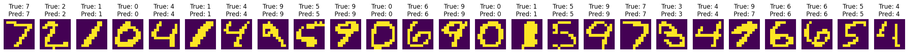
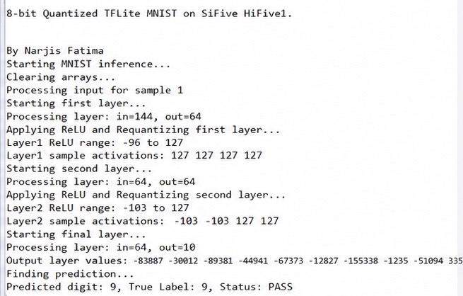
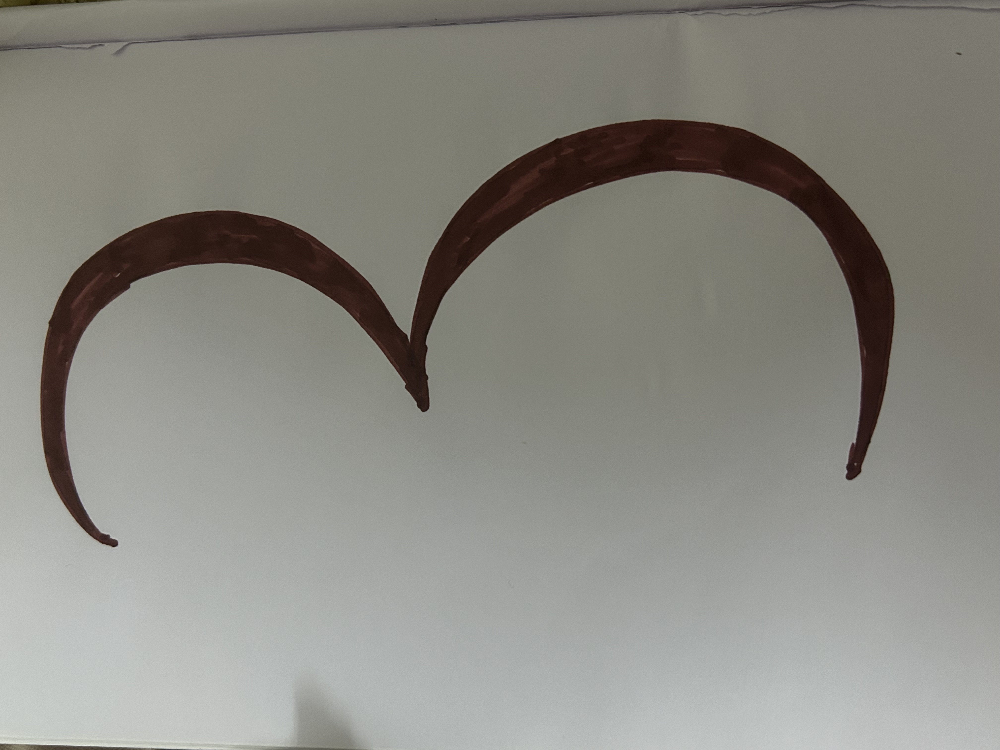
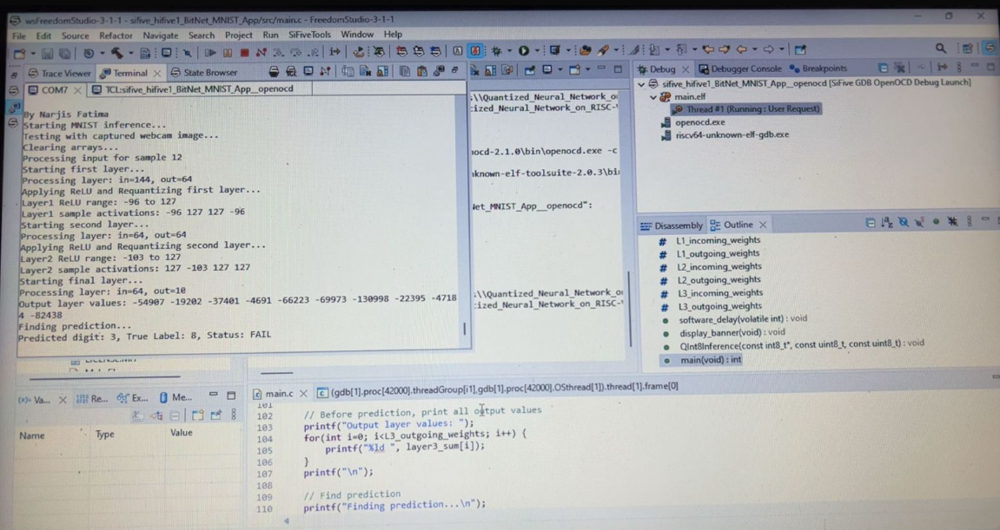

# VSDSquadron PRO Internship


## Task 1 – Hardware Setup & Validation (VSDSquadron PRO)


---


## Objective


The objective of this task is to:


- Install and configure the RISC-V development environment


- Validate hardware functionality using the VSDSquadron PRO board


- Upload and execute a basic program


- Understand hardware specifications


- Document the complete setup process clearly


This task forms the foundation for further Edge AI and embedded systems development.


---


## Overview


This repository documents the complete setup and validation of the VSDSquadron PRO RISC-V board.


## Contents
- [Installation Guide](installation_guide.md)
- [System Configuration](system_config.md)
- [Commands Used](commands_used.md)
- [Hardware Summary](hardware_summary.md)
- [issues_faced](issues_faced.md)
- [Screenshots](screenshots/)

---

## Board Used
VSDSquadron PRO (SiFive based RISC-V board)

---


## Screenshots

### Driver Installation


### Setup Process


### Debug Session


### Output / Execution


### Hardware Setup



---

# Task 2 – Embedded AI Model for Handwritten Digit Recognition
# BitNet-like Quantized MNIST Classification on VSDsquadron PRO

This project demonstrates deployment of a quantized handwritten digit recognition model on the VSDsquadron PRO board powered by the SiFive FE310-G002 RISC-V microcontroller.

The implementation uses TensorFlow Lite generated model parameters integrated with Embedded C for lightweight AI inference on resource-constrained hardware.

---

# Aim

The aim of this project is to implement and deploy a handwritten digit recognition system on embedded RISC-V hardware using quantized neural network techniques.

This project demonstrates:

- AI model deployment on embedded systems
- Quantized inference using TensorFlow Lite
- Embedded C integration
- RISC-V based hardware acceleration
- Real-time digit prediction on VSDsquadron PRO

---

# Features

- Quantized MNIST handwritten digit recognition
- TensorFlow Lite model conversion
- Embedded C based inference engine
- RISC-V compatible implementation
- Lightweight execution on VSDsquadron PRO
- Real-time serial output prediction

---

# Hardware Used

- VSDsquadron PRO Board
- SiFive FE310-G002 RISC-V MCU
- USB Type-C Cable
- Windows Laptop

---

# Software Requirements

### Freedom Studio 3.1.1
IDE used for RISC-V embedded development and debugging.

### Python 3.x
Used for model conversion and parameter generation.

### Python Libraries

```bash
pip install tensorflow numpy matplotlib jupyter
```

---

# Project Structure

```text
sifive_hifive1_BitNet_MNIST_App/

├── src/
│ ├── main.c
│ ├── app_inference.h
│ ├── mnist_model_data.h
│ ├── mnist_model_params.c
│ ├── mnist_model_params.h
│ └── generate_c_model_params.py
│
├── mnist_baseline_model.ipynb
├── mnist_quantized_model.tflite
├── Makefile
└── README.md
```

---

# Getting Started

## 1. Install Freedom Studio

Install Freedom Studio and required drivers for VSDsquadron PRO board.

---

## 2. Setup Python Environment

Install Python and required libraries:

```bash
pip install tensorflow numpy matplotlib jupyter
```

---

## 3. Generate C Model Parameters and Sample Inputs

The notebook trains and quantizes the MNIST model and converts it into TensorFlow Lite format.

### Run Jupyter Notebook

Open and execute:

```text
mnist_baseline_model.ipynb
```

This generates:

```text
mnist_quantized_model.tflite
```

---

## 4. Run Parameter Generation Script

Navigate to the source directory and execute:

```bash
python generate_c_model_params.py
```

This generates:

- mnist_model_params.c
- mnist_model_params.h

These files contain:

- Quantized weights
- Bias values
- Scale factors
- Sample input images
- Digit labels

---

# Build the Embedded Application

## Step 1: Open Project

Open Freedom Studio and import the project.

---

## Step 2: Clean Project

Go to:

```text
Project → Clean
```

Select your project and clean it.

---

## Step 3: Build Project

Go to:

```text
Project → Build Project
```

Expected Result:

```text
Build Finished with 0 errors
```

---

# Configure and Run on VSDsquadron PRO

## Connect Board

Connect the VSDsquadron PRO board using USB Type-C cable.

---

## Configure Debug Session

Go to:

```text
Run → Debug Configurations
```

Select:

```text
GDB OpenOCD Debugging
```

Ensure correct executable path is selected.

---

## Start Debugging

Click:

```text
Debug
```

Program will load into hardware memory.

---

## Run Application

Press the Resume/Run button.

The serial terminal displays prediction outputs.

---

# Output

Example terminal output:

```text
BitNet MNIST Dataset Handwritten Digit Classification on sifive-hifive1.


By Narjis FatimaStarting MNIST inference...
Inference of Sample 1   Prediction: 7   Label: 7
Inference of Sample 2   Prediction: 2   Label: 2
Inference of Sample 3   Prediction: 0   Label: 1
Inference of Sample 4   Prediction: 0   Label: 0
```

This confirms successful deployment and execution on RISC-V hardware.

---

# Model Details

The model is a quantized neural network trained using TensorFlow/Keras on the MNIST handwritten digit dataset.

### Architecture

- Input Layer: 28x28 grayscale image
- Hidden Layer: Dense layer with ReLU activation
- Output Layer: 10-class digit prediction

### Quantization

- 8-bit integer quantization
- Reduced memory footprint
- Faster embedded execution

---

# Troubleshooting / Common Issues

### Python Not Configured

Configure Python interpreter in Freedom Studio preferences.

---

### OpenOCD Connection Failed

Check:

- USB connection
- Driver installation
- COM port availability

---

### Build Errors

Ensure:

- Correct project imported
- All source files present
- Python libraries installed

---

### Debug Session Issues

Verify:

- Correct executable selected
- Board connected properly
- OpenOCD configuration correct

---

# Learning Outcomes

Through this project, I learned:

- Embedded AI deployment
- TensorFlow Lite integration
- Quantized neural networks
- RISC-V debugging workflow
- Embedded C programming
- Freedom Studio configuration

---
## Screenshots

### Build Output



### Program Output



---
# Conclusion

This project successfully demonstrates deployment of a quantized handwritten digit recognition model on VSDsquadron PRO using RISC-V architecture and embedded AI techniques.

---

## TASK-3 : Neural Network Training Optimization

### Objective

The objective of this task was to optimize neural network training parameters to improve model accuracy while maintaining suitability for deployment on the VSDSquadron PRO board.

### Training Experiments

The following parameters were modified and tested:

- Learning Rate
- Activation Functions
- Dense Layer Configuration
- Number of Training Epochs
- Model Quantization
- Input Preprocessing Techniques

### Model Summary
```text
Model: "sequential_12"
_________________________________________________________________
 Layer (type)                Output Shape              Param #   
=================================================================
 flatten_12 (Flatten)        (None, 144)               0         
                                                                 
 dense_36 (Dense)            (None, 64)                9280      
                                                                 
 leaky_re_lu_6 (LeakyReLU)   (None, 64)                0         
                                                                 
 dense_37 (Dense)            (None, 64)                4160      
                                                                 
 leaky_re_lu_7 (LeakyReLU)   (None, 64)                0         
                                                                 
 dense_38 (Dense)            (None, 10)                650       
                                                                 
=================================================================
Total params: 14090 (55.04 KB)
Trainable params: 14090 (55.04 KB)
Non-trainable params: 0 (0.00 Byte)

INT8 TFLite model saved to mnist_model_int8.tflite
INT8 Model Size: 17768 bytes (17.35 KB)
Cleaned up temporary Keras model file: mnist_baseline_model.keras

Model Details:
Input: [{'name': 'serving_default_flatten_12_input:0', 'index': 0, 'shape': array([ 1, 12, 12,  1]), 'shape_signature': array([-1, 12, 12,  1]), 'dtype': <class 'numpy.int8'>, 'quantization': (0.003921568859368563, -128), 'quantization_parameters': {'scales': array([0.00392157], dtype=float32), 'zero_points': array([-128]), 'quantized_dimension': 0}, 'sparsity_parameters': {}}]
Output: [{'name': 'StatefulPartitionedCall:0', 'index': 14, 'shape': array([ 1, 10]), 'shape_signature': array([-1, 10]), 'dtype': <class 'numpy.int8'>, 'quantization': (0.00390625, -128), 'quantization_parameters': {'scales': array([0.00390625], dtype=float32), 'zero_points': array([-128]), 'quantized_dimension': 0}, 'sparsity_parameters': {}}]
```
----
For details please refer to the comprehensive attachments:

[src](./Task-2-Hardwritten-Digital-Recognition)

References:

i. [Optimizing Edge AI: A Comprehensive Survey](./Optimizing_Edge_AI_A_Comprehensive_Survey.pdf)

ii. https://docs.edgeimpulse.com/docs/concepts/machine-learning/neural-networks/loss-functions

iii. [12 Types of Activation Functions in Neural Networks: A Comprehensive Guide (Medium)](https://medium.com/@sushmita2310/12-types-of-activation-functions-in-neural-networks-a-comprehensive-guide-a441ecefb439?utm_source=chatgpt.com)

---
### Optimization Results

- Successfully trained and optimized the neural network.
- Generated an INT8 quantized TFLite model.
- Reduced model size for embedded deployment.
- Verified correct inference output.

### Output
```text
The optimized model successfully predicted handwritten MNIST digits and produced accurate results suitable for deployment on embedded hardware.
8-bit Quantized TFLite MNIST on SiFive HiFive1.


By Narjis Fatima
Starting MNIST inference...
Clearing arrays...
Processing input for sample 1
Starting first layer...
Processing layer: in=144, out=64
Applying ReLU and Requantizing first layer...
Layer1 ReLU range: -96 to 127
Layer1 sample activations: 127 127 127 127
Starting second layer...
Processing layer: in=64, out=64
Applying ReLU and Requantizing second layer...
Layer2 ReLU range: -103 to 127
Layer2 sample activations: -103 -103 127 127
Starting final layer...
Processing layer: in=64, out=10
Output layer values: -61807 -25412 -16241 -6761 -82783 -24893 -197008 25675 -55464 -84508 
Finding prediction...
Predicted digit: 7, True Label: 7, Status: PASS

Clearing arrays...
Processing input for sample 2
Starting first layer...
Processing layer: in=144, out=64
Applying ReLU and Requantizing first layer...
Layer1 ReLU range: -96 to 127
Layer1 sample activations: -96 -96 127 -96
Starting second layer...
Processing layer: in=64, out=64
Applying ReLU and Requantizing second layer...
Layer2 ReLU range: -103 to 127
Layer2 sample activations: -103 -103 127 -103
Starting final layer...
Processing layer: in=64, out=10
Output layer values: -90097 -7702 33439 -31831 -96813 -24433 -170098 -38725 -17284 -116708 
Finding prediction...
Predicted digit: 2, True Label: 2, Status: PASS

Clearing arrays...
Processing input for sample 3
Starting first layer...
Processing layer: in=144, out=64
Applying ReLU and Requantizing first layer...
Layer1 ReLU range: -96 to 127
Layer1 sample activations: 127 127 127 127
Starting second layer...
Processing layer: in=64, out=64
Applying ReLU and Requantizing second layer...
Layer2 ReLU range: -103 to 127
Layer2 sample activations: -103 -103 -103 127
Starting final layer...
Processing layer: in=64, out=10
Output layer values: -88717 13688 -1291 -50001 -17923 -63073 -84308 25675 -58684 -116018 
Finding prediction...
Predicted digit: 7, True Label: 1, Status: FAIL

Clearing arrays...
Processing input for sample 4
Starting first layer...
Processing layer: in=144, out=64
Applying ReLU and Requantizing first layer...
Layer1 ReLU range: -96 to 127
Layer1 sample activations: 127 127 -96 -96
Starting second layer...
Processing layer: in=64, out=64
Applying ReLU and Requantizing second layer...
Layer2 ReLU range: -103 to 127
Layer2 sample activations: 127 -103 127 -103
Starting final layer...
Processing layer: in=64, out=10
Output layer values: -21834 -73887 -41751 -90044 -43817 -15372 -67014 5118 -61485 -94200 
Finding prediction...
Predicted digit: 0, True Label: 0, Status: PASS

Clearing arrays...
Processing input for sample 5
Starting first layer...
Processing layer: in=144, out=64
Applying ReLU and Requantizing first layer...
Layer1 ReLU range: -96 to 127
Layer1 sample activations: -96 127 127 127
Starting second layer...
Processing layer: in=64, out=64
Applying ReLU and Requantizing second layer...
Layer2 ReLU range: -103 to 127
Layer2 sample activations: -103 127 127 -103
Starting final layer...
Processing layer: in=64, out=10
Output layer values: -25467 -8162 -53271 -105661 -36093 -103553 -70738 -25615 -16824 -19648 
Finding prediction...
Predicted digit: 4, True Label: 4, Status: PASS

Clearing arrays...
Processing input for sample 6
Starting first layer...
Processing layer: in=144, out=64
Applying ReLU and Requantizing first layer...
Layer1 ReLU range: -96 to 127
Layer1 sample activations: 127 127 127 127
Starting second layer...
Processing layer: in=64, out=64
Applying ReLU and Requantizing second layer...
Layer2 ReLU range: -103 to 127
Layer2 sample activations: 127 -103 127 127
Starting final layer...
Processing layer: in=64, out=10
Output layer values: -74917 21278 -47751 -74151 -57023 -46973 -61078 -11585 -66044 -63808 
Finding prediction...
Predicted digit: 1, True Label: 1, Status: PASS

Clearing arrays...
Processing input for sample 7
Starting first layer...
Processing layer: in=144, out=64
Applying ReLU and Requantizing first layer...
Layer1 ReLU range: -96 to 127
Layer1 sample activations: 127 127 127 127
Starting second layer...
Processing layer: in=64, out=64
Applying ReLU and Requantizing second layer...
Layer2 ReLU range: -103 to 127
Layer2 sample activations: -103 -103 127 127
Starting final layer...
Processing layer: in=64, out=10
Output layer values: -75837 -28402 -81331 -52531 -42533 -25583 -87988 -19175 -36144 -85658 
Finding prediction...
Predicted digit: 4, True Label: 4, Status: PASS

Clearing arrays...
Processing input for sample 8
Starting first layer...
Processing layer: in=144, out=64
Applying ReLU and Requantizing first layer...
Layer1 ReLU range: -96 to 127
Layer1 sample activations: -96 -96 127 127
Starting second layer...
Processing layer: in=64, out=64
Applying ReLU and Requantizing second layer...
Layer2 ReLU range: -103 to 127
Layer2 sample activations: -103 -103 127 127
Starting final layer...
Processing layer: in=64, out=10
Output layer values: -125747 -75092 -60861 -20331 -6193 -43753 -147558 -46315 6406 24972 
Finding prediction...
Predicted digit: 9, True Label: 9, Status: PASS

Clearing arrays...
Processing input for sample 9
Starting first layer...
Processing layer: in=144, out=64
Applying ReLU and Requantizing first layer...
Layer1 ReLU range: -96 to 127
Layer1 sample activations: 127 127 -96 127
Starting second layer...
Processing layer: in=64, out=64
Applying ReLU and Requantizing second layer...
Layer2 ReLU range: -103 to 127
Layer2 sample activations: 127 -103 127 -103
Starting final layer...
Processing layer: in=64, out=10
Output layer values: -98607 -4712 -55341 -94621 -7803 -2813 -55098 -6065 -51324 -89568 
Finding prediction...
Predicted digit: 5, True Label: 5, Status: PASS

Clearing arrays...
Processing input for sample 10
Starting first layer...
Processing layer: in=144, out=64
Applying ReLU and Requantizing first layer...
Layer1 ReLU range: -96 to 127
Layer1 sample activations: 127 127 127 127
Starting second layer...
Processing layer: in=64, out=64
Applying ReLU and Requantizing second layer...
Layer2 ReLU range: -103 to 127
Layer2 sample activations: -103 -103 127 127
Starting final layer...
Processing layer: in=64, out=10
Output layer values: -83887 -30012 -89381 -44941 -67373 12827 -155838 -1235 -51094 3352 
Finding prediction...
Predicted digit: 9, True Label: 9, Status: PASS
```
---

---
## Inputs


## Predictions



---
### Deployment Output



## Conclusion

The neural network training optimization task was completed successfully. Multiple training configurations were evaluated to improve model accuracy while maintaining suitability for deployment on the VSDSquadron PRO board.

The final optimized model was quantized to INT8 TFLite format, reducing memory usage and improving deployment efficiency. The inference pipeline was successfully tested, and the model accurately predicted MNIST handwritten digits on the target hardware platform.

This task provided practical experience in neural network optimization, quantization, model deployment, and embedded AI inference on RISC-V hardware.

---

TASK 4: Complete Inference Pipeline Successfully Tested and Deployed
---
Overview

The final stage of the project focused on validating the complete inference pipeline on the SiFive HiFive1 RISC-V development board. After optimizing and quantizing the neural network model, the generated model parameters were integrated into the embedded application and deployed successfully on the target hardware.

The objective of this phase was to verify that the quantized model could correctly perform handwritten digit recognition while operating within the resource constraints of an embedded RISC-V platform.

---
Directory Structure

The project contains all required files for model training, quantization, parameter generation, deployment, and inference testing.

---
Prerequisites

The following software and hardware components were used:

VSD SquadrON PRO / SiFive HiFive1 Board
Freedom Studio IDE
RISC-V GNU Toolchain
OpenOCD Debugger
Python 3.x
TensorFlow
NumPy
OpenCV
PySerial

----
Workflow
The complete deployment pipeline consisted of the following stages:

Train the neural network model using TensorFlow.
Optimize and quantize the trained model to INT8 TFLite format.
Generate C source and header files containing model parameters.
Integrate generated files into the RISC-V embedded application.
Build and flash the application using Freedom Studio.
Execute inference on the target hardware.
Verify prediction accuracy and deployment success.
Inference Input
The handwritten digit image captured and processed for testing is shown below.

---

Deployment Output
The application was successfully deployed and executed on the target hardware. The processed image was supplied to the inference engine, and the model generated the corresponding prediction.

---
Freedom Studio Execution
The terminal output from Freedom Studio confirms successful execution of the inference pipeline, including layer processing, activation calculations, and final prediction generation.

---
Results
Model successfully converted to INT8 TFLite format.
C model parameters generated successfully.
Application compiled without errors.
Firmware flashed successfully to the board.
Inference executed correctly on hardware.
Predicted digit matched the expected input.
End-to-end deployment pipeline validated successfully.

---
To Run Inference
```text
 1. mnist_baseline_model.ipynb > generate_c_model_params.py > main.c
 2. cam_capture_image.py > main.c
```
## Input



## Output



---
Conclusion
The neural network training optimization task was completed successfully. Multiple model configurations and optimization techniques were evaluated to improve accuracy while maintaining suitability for embedded deployment.

The final optimized model was quantized to INT8 TensorFlow Lite format, significantly reducing memory usage and computational requirements. The generated model parameters were integrated into the embedded RISC-V application and deployed successfully using Freedom Studio.

Hardware validation demonstrated that the complete inference pipeline operated correctly on the target platform. The model accurately processed handwritten digit inputs and generated correct predictions, confirming successful deployment of an optimized neural network on resource-constrained embedded hardware.

